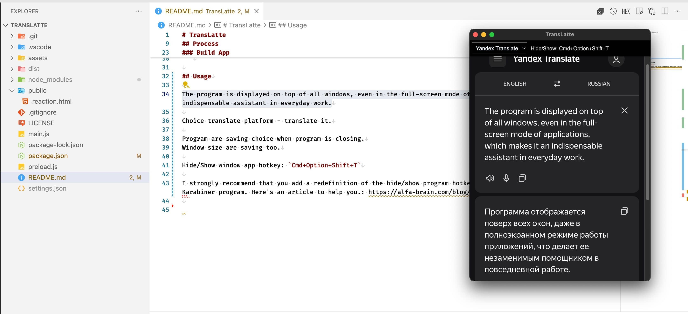

# TransLatte

An application for fast text translation wherever you are.


## Usage

The program is displayed on top of all windows, even in the full-screen mode of applications, which makes it an indispensable assistant in everyday work.

Choice translate platform - translate it.

Program are saving choice when program is closing.
Window size are saving too.

Hide/Show window app hotkey: `Cmd+Option+Shift+T`

I strongly recommend that you add a redefinition of the hide/show program hotkeys by one key. You can do this using the Karabiner program. Here's an article to help you.: <https://alfa-brain.com/blog/17ce8147-6d4a-469d-ac1b-cc0bfa67590a>



## Prerequisites

NodeJS 22

## Process

### Install deps

```sh
npm install
```

### Dev App

```sh
npm run start
```

### Build App

Build it for your processor.
After installing deps, run command:

```sh
npm run build
```

